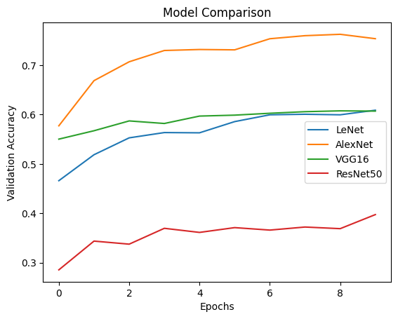

# 🧠 CNN on CIFAR-10

This project implements a Convolutional Neural Network (CNN) to classify images from the CIFAR-10 dataset.

## 📌 Features

* Image classification using CNN
* Built with TensorFlow / Keras
* Trained on CIFAR-10 dataset
* Visualized accuracy and loss

## 📂 Files

* `ashna_cnn_cifar.ipynb` → Main notebook

## 🚀 How to Run

1. Clone the repository

```bash
git clone https://github.com/ashnajbn/cnn-cifar10-project.git
```

2. Open the notebook

```bash
jupyter notebook
```

## 📊 Dataset

* CIFAR-10 dataset (10 image classes like airplane, car, bird, etc.)

## 📈 Results

### 🔍 Model Comparison (Validation Accuracy)



### 📊 Insights

* **AlexNet** achieved the highest validation accuracy (~0.76)
* **VGG16** showed stable and consistent performance (~0.60)
* **LeNet** improved gradually but remained moderate (~0.61)
* **ResNet50** performed lower due to possible underfitting or limited training

This comparison highlights how deeper architectures impact performance on CIFAR-10.


## 🛠️ Tech Stack

* Python
* TensorFlow / Keras
* NumPy
* Matplotlib

## 👩‍💻 Author

Ashna (https://github.com/ashnajbn)
